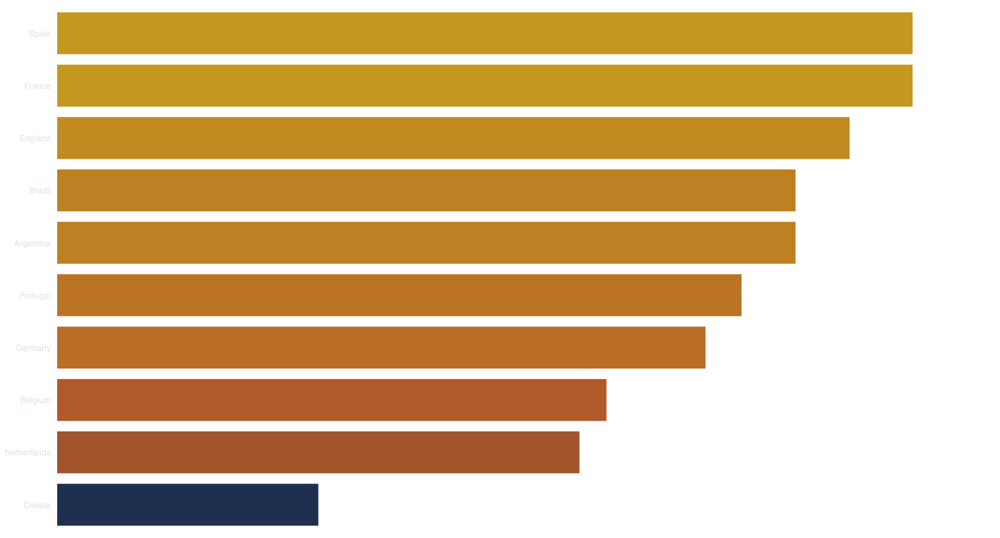
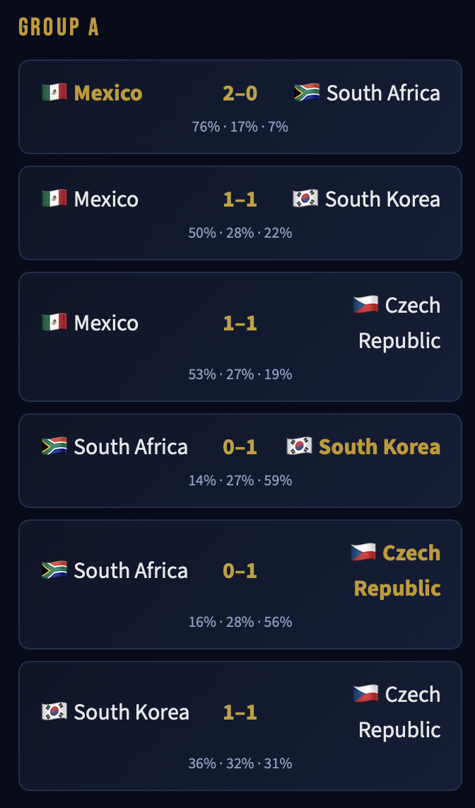
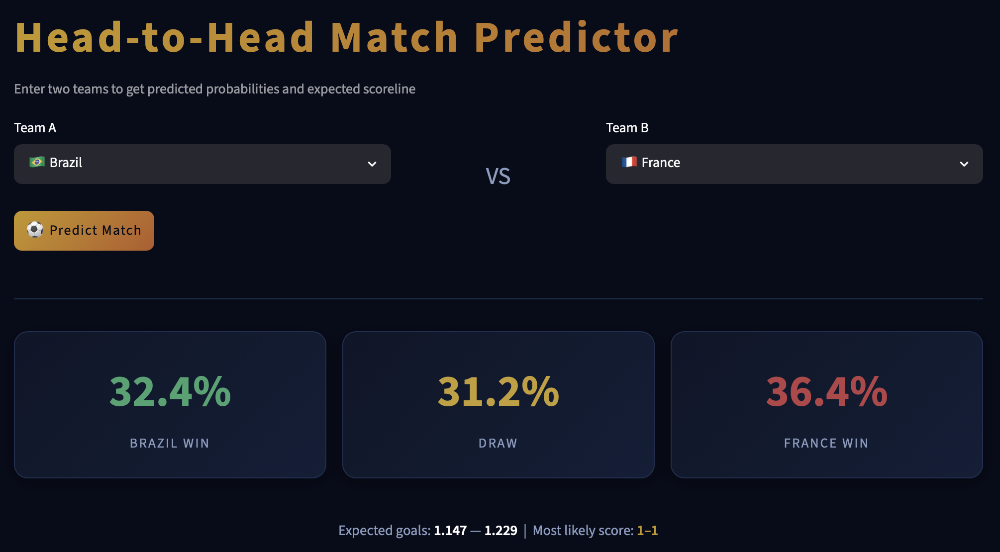
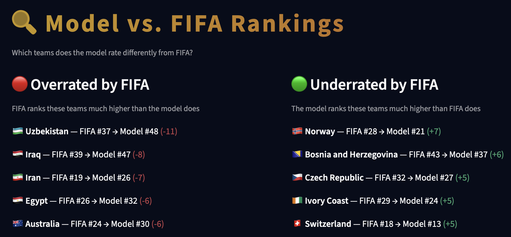

# ⚽ FIFA World Cup 2026 Predictor

A statistical model for predicting the 2026 FIFA World Cup - built with Poisson regression, Glicko-1 ratings, and 10,000 Monte Carlo simulations of the full 48-team tournament.



## Features

- **Tournament Odds** - Win probabilities for all 48 teams from 10,000 Monte Carlo simulations, with per-team stage breakdown
- **Group Stage Predictor** - Most likely scoreline for all 72 group matches, with predicted final standings and 3rd-place qualifiers
- **Head-to-Head Predictor** - Win/draw/loss probabilities and a full score probability matrix for any WC 2026 matchup
- **Model vs FIFA Rankings** - See which teams the model rates differently from the official FIFA rankings

## Screenshots

| Group Stage Predictor | Head-to-Head Predictor |
|---|---|
|  |  |



## How It Works

Goals scored by each team are modelled as **Poisson(λ)**:

```
λ = exp(β₀ + β_elo·elo_diff + β_rank·ranking_diff + β_home·is_home
        + β_form·form_scored + β_squad·squad_rating_diff + β_rd·rd_combined)
```

| Feature | Description |
|---|---|
| `elo_diff` | Glicko-1 rating difference (uncertainty-aware, replaces classic Elo) |
| `ranking_diff` | FIFA ranking difference |
| `is_home` | Home advantage - applied for host nations USA, Canada, Mexico |
| `form_scored` | Rolling average goals scored over the last 10 matches |
| `squad_rating_diff` | EA FC squad average overall rating difference |
| `rd_combined` | Average Glicko rating deviation - high uncertainty shrinks predictions toward 50/50 |

Win/Draw/Loss probabilities come from the joint score distribution, with a **Dixon-Coles correction** (ρ = −0.13) for low-scoring outcomes.

Tournament odds are derived from **10,000 Monte Carlo simulations** of the official WC 2026 bracket, including the 3rd-place qualification rules for the Round of 32.

## Setup

**1. Get the data**

Download the international football results dataset from Kaggle and place it at `data/raw/results.csv`:

```bash
kaggle datasets download martj42/international-football-results-from-1872-to-2017
```

Optionally, download EA FC player ratings (for squad quality features) and place CSVs in `data/raw/fifa_ratings/`.

**2. Install dependencies**

```bash
pip install -r requirements.txt
```

**3. Run the pipeline**

```bash
python src/data_loader.py       # process data & compute Glicko-1 ratings
python src/model.py             # train Poisson regression model
python src/simulator.py         # run 10,000 tournament simulations
streamlit run dashboard/app.py  # launch dashboard
```

## Project Structure

```
├── src/
│   ├── data_loader.py    # data pipeline, Glicko-1 ratings, feature engineering
│   ├── model.py          # Poisson regression model (fit, predict, save/load)
│   └── simulator.py      # Monte Carlo tournament simulator
├── dashboard/
│   └── app.py            # Streamlit dashboard (5 pages)
├── data/
│   ├── raw/              # source data (not committed)
│   └── processed/        # pipeline outputs (not committed)
├── models/               # trained model (not committed)
└── requirements.txt
```

## Data Sources

- **Match results**: [International Football Results 1872–2024](https://www.kaggle.com/datasets/martj42/international-football-results-from-1872-to-2017) (Kaggle, martj42)
- **Squad ratings**: EA FC player ratings dataset (optional, improves squad quality feature)
- **FIFA rankings & WC 2026 bracket**: hardcoded from official sources (June 2026)

## Tech Stack

Python · Pandas · NumPy · SciPy · scikit-learn · Streamlit · Plotly
